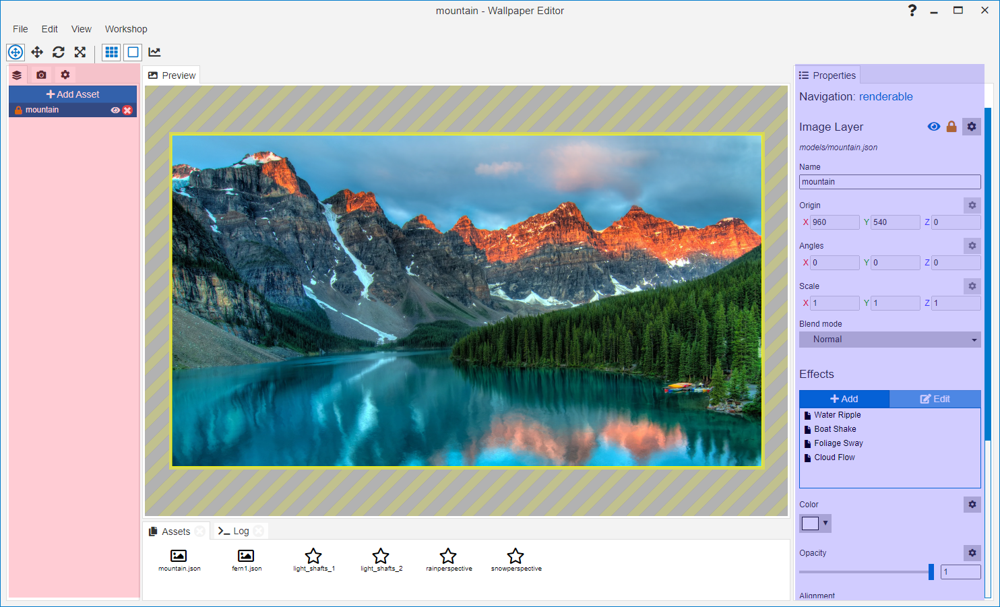

# #2 Adding your first effects

In this tutorial, we will be working with an image with a lake, trees and a mountain ([Click here to download](/img/tutorials/mountain.png)) which we will use to showcase a few basic effects. 

After your image has been imported, you will be presented with the main Wallpaper Engine editor window. In this section, we will explain what **effects** are and how to apply them. Image effects can be found on the right-hand side of the editor in the properties section (marked in blue in the following screenshot): 

Effects are always applied to **assets**. Right now, your wallpaper only contains a single asset: The background image which you have imported.

## Animating the waterfront

We will start by animating the waterfront using the **Water Ripple** effect. On the right-hand side, click on the **Add** button in the effects section. A pop-up will open from which you can see all currently installed effects. Select the **Water Ripple** effect and confirm by clicking the **OK** button.

You will immediately notice that the complete wallpaper gets a water effect applied to it which is the default behavior. In this case, we only want the water effect to be applied to the lake area of the image.

We can do so by painting an *Opacity Mask*. Click on the **Paint** button in the *Opacity Mask* section once the effect is applied.

<video width="100%" controls>
  <source src="/videos/opacity_mask.mp4" type="video/mp4">
  Your browser does not support the video tag.
</video> 