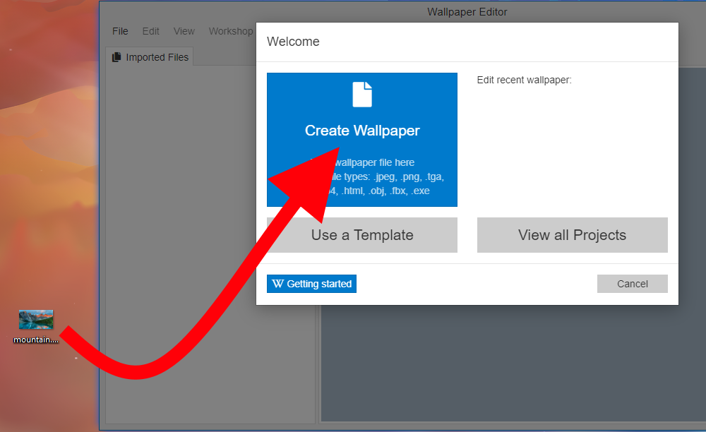
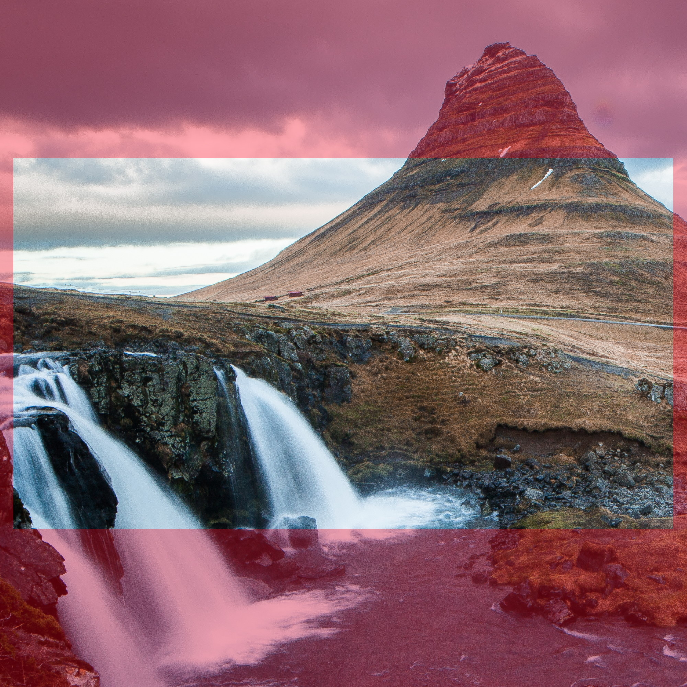

# #1 Getting started with your first wallpaper

Welcome to the quick-start guide for the Wallpaper Engine editor! This tutorial series will lead you through the most important features of the Wallpaper Engine editor. After you are done with this tutorial, you will understand how to handle the Wallpaper Engine editor user interface, how to apply effects and add additional content to your wallpapers. You will also be able to add configurable options to your wallpaper so that users can customize and tweak your wallpaper even further.

The Wallpaper Engine editor is very powerful and caters to casual and advanced users alike. Once you have mastered the basics, you can move on to the more advanced features which are handled in other sections of the Wallpaper Engine documentation. If you ever get lost, feel free to reach out to us or the Wallpaper Engine community.

## Importing your image

Once you open the Wallpaper Engine editor, you are presented with the welcome screen of the editor. You can simply drag and drop the image you want to animate into the **Create Wallpaper** button to get started:

If you would like to follow along this tutorial, you can use the example image we will be using in the following sections by downloading it from this link (1920 x 1080 resolution): 

* [Click here to download the sample image](/img/tutorials/mountain.png)

## A foreword on wallpaper resolutions

Before jumping into animating your wallpaper, first a quick word on preparing any background images you want to animate:

It's best practice to prepare your background image with a photo editor of your choice to **ensure that the wallpaper uses a resolution that exists on computer monitors**. Strictly speaking, this is not necessary and Wallpaper Engine will accept any image resolution, however, you will achieve the best performance if the wallpaper matches the resolution of your screen or at least the correct aspect ratio. 

The most common resolutions are **1920x1080** ("Full HD") and **3840x2160** ("4K UHD"). If your wallpaper does not use a resolution from the supported resolution list, it will be marked as **Other Resolution** which may negatively affect its popularity.

::: details Click here to view all official resolutions
*The following resolutions were selected based on the most common resolutions on the market:*

**16:9**
* 1280 x 720
* 1366 x 768
* 1920 x 1080
* 2560 x 1440
* 3840 x 2160 

**Two screens or one ultrawide screen**
* 2560 x 1080 (Ultrawide)
* 3440 x 1440 (Ultrawide)
* 3840 x 1080 (2x Full HD or 1x Ultrawide)
* 5120 x 1440 (2x 1440p or 1x Ultrawide)
* 7680 x 2160 (2x 4K UHD)

**Triple screens**
* 4096 x 768 (3x 768p)
* 5760 x 1080 (3x Full HD)
* Triple 7680 x 1440 (3x 1440p)
* Triple 11520 x 2160 (3x 4K UHD)

**Portrait aspect ratios (screen turned by 90°)**
* 720 x 1280 (Portrait 9:16)
* 1080 x 1920 (Portrait 9:16)
* 1440 x 2560 (Portrait 9:16)
* 2160 x 3840 (Portrait 9:16)
:::

To exemplify why it's bad to use wallpapers that do not have a real aspect ratio: Let's say you have an image that is 2000x2000 pixels. No computer monitor on the market has this resolution, so when you import and animate an image with this resolution, Wallpaper Engine will cut off the sides of your wallpaper once you apply it to your desktop to make it fit to your screen. The following image showcases how much is cut off if you use a 2000x2000 image on a 1920x1080 monitor:

*Red areas would be cut off if this square images was displayed on a 16:9 monitor.*

The downsides of this are an increased GPU usage, less control over what is actually visible on the screen and larger file sizes and VRAM usage.

We generally recommend you scale down images to the nearest closer real resolution and then manually crop off excess areas. You can use free image editing tools like Microsoft Paint, Paint.NET, GIMP or paid alternatives such as Adobe Photoshop to do this. Again, it's not necessary but we recommend preparing background images before importing them.